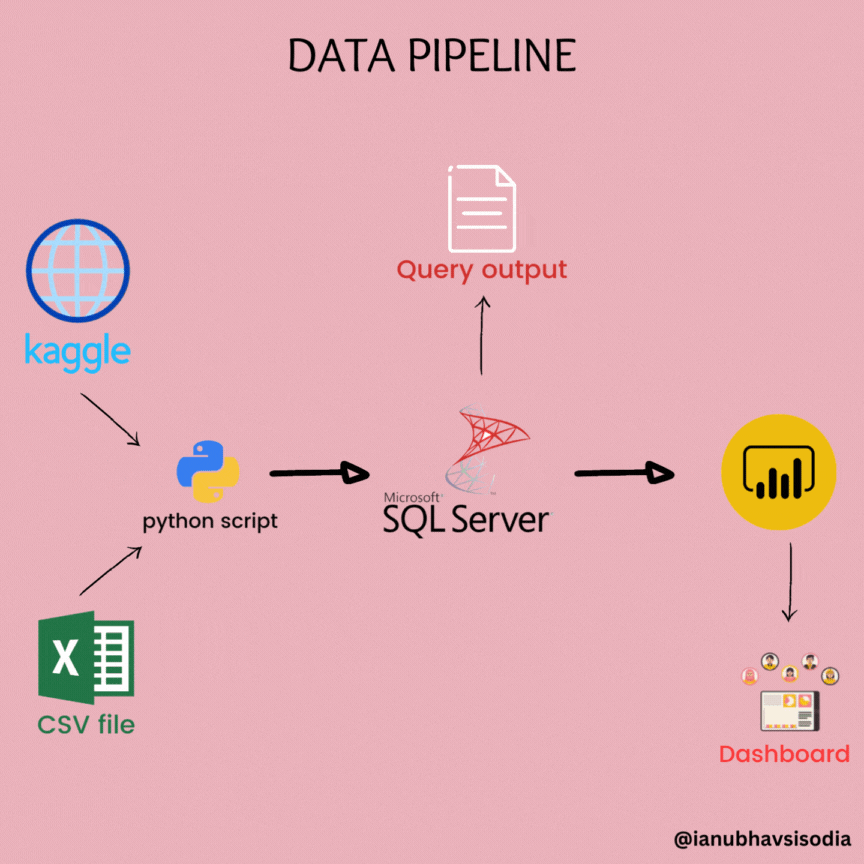

# Data Analysis : Excel to Power BI 🧑‍💻



📂We are pulling data from Kaggle, exploring and analysing it in Excel, cleaning and testing it in SQL, and visualizing it in Power BI.


# Table of contents 

- [Objective](#objective)
- [User Story](#User-Story)
- [Data Source](#data-source)
- [Stages](#stages)
- [Design](#design)
  - [Dashboard Mockup](#mockup)
  - [Tools](#tools)
- [Development](#development)
  - [Pseudocode](#pseudocode)
  - [Data Exploration](#data-exploration)
  - [Data Cleaning](#data-cleaning)
  - [Transform the Data](#transform-the-data)
  - [Create the SQL View](#create-the-sql-view)
- [Testing](#testing)
  - [Data Quality Tests](#data-quality-tests)
- [Visualization](#visualization)
  - [Results](#results)
  - [DAX Measures](#dax-measures)
- [Analysis](#analysis)
  - [Findings](#findings)
  - [Validation](#validation)
  - [Discovery](#discovery)
- [Recommendations](#recommendations)
  - [Potential ROI](#potential-roi)
  - [Action Plan](#potential-courses-of-actions)


# Objective 

- What is the key pain point? 

To discover the top performing INDIA YouTubers to form marketing collaborations with throughout
the year 2024. 


- What is the ideal solution? 

To create a dashboard that provides insights into the top India YouTubers in 2024 that includes their 
- subscriber count
- total views
- total videos
- subscriber engagement metrics

This will help the marketing team make informed decisions about which YouTubers to collaborate with for their marketing campaigns.


## User Story 

- What is the problem statement?

• The Head of Marketing has to find the top YouTube channels in the INDIA to
run marketing campaigns with difficult.
• She has performed online research but constantly bumps into overly complicated and
conflicting insights
• She has also held calls with different third-party providers, but they are all expensive options
for underwhelming results
• The BI reporting team lack the bandwidth to assist her with this assignment


# Data source 

- What data is needed to achieve our objective?

We need data on the top UK YouTubers in 2024 that includes their 
- channel names
- total subscribers
- total views
- total videos uploaded

- Where is the data coming from? 
The data is sourced from Kaggle (an Excel extract), [see here to find it.](https://www.kaggle.com/datasets/bhavyadhingra00020/top-100-social-media-influencers-2024-countrywise?resource=download)


# Stages

- Design
- Developement
- Testing
- Analysis 
 


# Design 

## Dashboard components required 
- What should the dashboard contain based on the requirements provided?

To understand what it should contain, we need to figure out what questions we need the dashboard to answer:

1. Who are the top 10 YouTubers with the most subscribers?
2. Which 5 channels have uploaded the most videos?
3. Which 5 channels have the most views?
4. Which 5 channels have the highest average views per video?
5. Which 5 channels have the highest views per subscriber ratio?
6. Which 5 channels have the highest subscriber engagement rate per video uploaded?

For now, these are some of the questions we need to answer, this may change as we progress down our analysis.


## Dashboard mockup

- What should it look like? 

Some of the data visuals that may be appropriate in answering our questions include:

1. Table
2. Treemap
3. Scorecards
4. Horizontal bar chart 


## Tools 


| Tool | Purpose |
| --- | --- |
| Excel | Exploring the data |
| SQL Server | Cleaning, testing, and analyzing the data |
| Power BI | Visualizing the data via interactive dashboards |
| GitHub | Hosting the project documentation and version control |
| Mokkup AI | Designing the wireframe/mockup of the dashboard | 


# Development

## Pseudocode

1. Get the data
2. Explore the data in Excel
3. Load the data into SQL Server
4. Clean the data with SQL
5. Test the data with SQL
6. Visualize the data in Power BI
7. Generate the findings based on the insights
8. Write the documentation + commentary
9. Publish the data to GitHub Pages


## Data exploration notes

This is the stage where you have a scan of what's in the data, anamolies, errors, inconcsistencies, missing data, etc  


1. There are at least 4 columns that contain the data we need for this analysis, which signals we have everything we need from the file without needing to contact the client for any more data. 
2. The first column contains the channel ID with what appears to be channel IDS, which are separated by a @ symbol - we need to extract the channel names from this.
3. Remove unnecessary columns by only selecting the ones we need.


## Data cleaning 
- What do we expect the clean data to look like? 

The aim is to refine our dataset to ensure it is structured and ready for analysis. 

The cleaned data should meet the following criteria and constraints:

- Only relevant columns should be retained.
- All data types should be appropriate for the contents of each column.
- No column should contain null values, indicating complete data for all records.

Below is a table outlining the constraints on our cleaned dataset:

| Property | Description |
| --- | --- |
| Number of Rows | 100 |
| Number of Columns | 4 |

And here is a tabular representation of the expected schema for the clean data:

| Column Name | Data Type | Nullable |
| --- | --- | --- |
| channel_name | VARCHAR | NO |
| total_subscribers | INTEGER | NO |
| total_views | INTEGER | NO |
| total_videos | INTEGER | NO |


### Data Cleaning Steps
- What steps are needed to clean and shape the data into the desired format?

1. Remove unnecessary columns by only selecting the ones we need
2. Extract the Youtube channel names from the first column
3. Rename the column names using aliases


### Transform the data 


```sql
/*
# 1. Select the required columns
# 2. Extract the channel name from the 'NAME' column
*/

SELECT 
CAST(SUBSTRING(NAME,1, Charindex('@',NAME)-1) as varchar(100)) AS channel_name,
total_subscribers, 
total_views, 
total_videos
FROM 
top_india_youtubers_2024;
```


### Create the SQL view 

```sql
/*
# 1. Create a view to store the transformed data
# 2. Cast the extracted channel name as VARCHAR(100)
# 3. Select the required columns from the top_uk_youtubers_2024 SQL table 
*/

-- 1.
CREATE VIEW view_india_youtubers_2024 AS

-- 2.
SELECT
    CAST(SUBSTRING(NAME, 1, CHARINDEX('@', NAME) -1) AS VARCHAR(100)) AS channel_name, -- 2. 
    total_subscribers,
    total_views,
    total_videos

-- 3.
FROM
    top_india_youtubers_2024;

```


# Testing 

- What data quality and validation checks are you going to create?

Here are the data quality tests conducted:


## Row count check
```sql
/*
# Count the total number of records (or rows) are in the SQL view
*/

SELECT
    COUNT(*) AS no_of_rows
FROM
    view_india_youtubers_2024;

```


## Column count check 
```sql
/*
# Count the total number of columns (or fields) are in the SQL view
*/


SELECT
    COUNT(*) AS column_count
FROM
    INFORMATION_SCHEMA.COLUMNS
WHERE
    TABLE_NAME = 'view_india_youtubers_2024'
```


## Data type check
```sql
/*
# Check the data types of each column from the view by checking the INFORMATION SCHEMA view
*/

-- 1.
SELECT
    COLUMN_NAME,
    DATA_TYPE
FROM
    INFORMATION_SCHEMA.COLUMNS
WHERE
    TABLE_NAME = 'view_india_youtubers_2024';
```


## Duplicate count check 
```sql
/*
# 1. Check for duplicate rows in the view
# 2. Group by the channel name
# 3. Filter for groups with more than one row
*/

-- 1.
SELECT
    channel_name,
    COUNT(*) AS duplicate_count
FROM
    view_india_youtubers_2024

-- 2.
GROUP BY
    channel_name

-- 3.
HAVING
    COUNT(*) > 1;
```


### Output


# Visualization 


## Results

- What does the dashboard look like?


This shows the Top India Youtubers in 2024 so far. 


## DAX Measures

### 1. Total Subscribers (M)
```sql
Total Subscribers (M) = 
VAR million = 1000000
VAR sumOfSubscribers = SUM(view_india_youtubers_2024[total_subscribers])
VAR totalSubscribers = DIVIDE(sumOfSubscribers,million)

RETURN totalSubscribers

```

### 2. Total Views (B)
```sql
Total Views (B) = 
VAR billion = 1000000000
VAR sumOfTotalViews = SUM(view_india_youtubers_2024[total_views])
VAR totalViews = ROUND(sumOfTotalViews / billion, 2)

RETURN totalViews

```

### 3. Total Videos
```sql
Total Videos = 
VAR totalVideos = SUM(view_india_youtubers_2024[total_videos])

RETURN totalVideos

```

### 4. Average Views Per Video (M)
```sql
Average Views per Video (M) = 
VAR sumOfTotalViews = SUM(view_india_youtubers_2024[total_views])
VAR sumOfTotalVideos = SUM(view_india_youtubers_2024[total_videos])
VAR avgViewsPerVideo = DIVIDE(sumOfTotalViews,sumOfTotalVideos, BLANK())
VAR finalAvgViewsPerVideo = DIVIDE(avgViewsPerVideo, 1000000, BLANK())

RETURN finalAvgViewsPerVideo 

```


### 5. Subscriber Engagement Rate
```sql
Subscriber Engagement Rate = 
VAR sumOfTotalSubscribers = SUM(view_india_youtubers_2024[total_subscribers])
VAR sumOfTotalVideos = SUM(view_india_youtubers_2024[total_videos])
VAR subscriberEngRate = DIVIDE(sumOfTotalSubscribers, sumOfTotalVideos, BLANK())

RETURN subscriberEngRate 

```


### 6. Views per subscriber
```sql
Views Per Subscriber = 
VAR sumOfTotalViews = SUM(view_india_youtubers_2024[total_views])
VAR sumOfTotalSubscribers = SUM(view_india_youtubers_2024[total_subscribers])
VAR viewsPerSubscriber = DIVIDE(sumOfTotalViews, sumOfTotalSubscribers, BLANK())

RETURN viewsPerSubscriber 

```


# Analysis 

## Findings

- What did we find?

For this analysis, we're going to focus on the questions below to get the information we need for our marketing client - 

Here are the key questions we need to answer for our marketing client: 
1. Who are the top 10 YouTubers with the most subscribers?
2. Which 5 channels have uploaded the most videos?
3. Which 5 channels have the most views?
4. Which 5 channels have the highest average views per video?
5. Which 5 channels have the highest views per subscriber ratio?
6. Which 5 channels have the highest subscriber engagement rate per video uploaded?


### 1. Who are the top 10 YouTubers with the most subscribers?

| Rank | Channel Name         | Subscribers (M) |
|------|----------------------|-----------------|
| 1    | T-Series             | 270.00          |
| 2    | SET India            | 175.00          |
| 3    | Zee Music Company    | 109.00          |
| 4    | Goldmines            | 98.60           |
| 5    | Sony SAB             | 94.20           |
| 6    | ChuChu TV            | 92.00           |
| 7    | Zee TV               | 82.40           |
| 8    | Colors TV            | 74.60           |
| 9    | SHemaroo Filmi Gaane | 69.00           |
| 10   | Tips Official        | 67.40           |


### 2. Which 5 channels have uploaded the most videos?

| Rank | Channel Name    | Videos Uploaded |
|------|-----------------|-----------------|
| 1    | ABP NEWS        | 3,93,419        |
| 2    | Aaj Tak         | 3,78,103        |
| 3    | IndiaTV         | 3,11,028        |
| 4    | Zee News        | 1,81,988        |
| 5    | Zee TV          | 1,80,488        |


### 3. Which 5 channels have the most views?


| Rank | Channel Name | Total Views (B) |
|------|--------------|-----------------|
| 1    | T-Series     | 262.00          |
| 2    | SET India    | 167.00          |
| 3    | Sony SAB     | 118.00          |
| 4    | Zee TV       | 92.36           |
| 5    | Colors TV    | 72.74           |


### 4. Which 5 channels have the highest average views per video?

| Rank | Channel Name       | Views per Video     |
|------|-----------------   |-------------------- |
| 1    | Sidhu Moose Wala   | 66574607.56         |
| 2    | ChuChu TV          | 65000477.83         |
| 3    | Infobells- Hindi   | 53538370.92         |
| 4    | Fun For Kids TV    | 45619168.83         |
| 5    | Shorts Break       | 45262322.39         |


### 5. Which 5 channels have the highest views per subscriber ratio?

| Rank | Channel Name       | Views per Subscriber        |
|------|-----------------   |---------------------------- |
| 1    | Zee5               | 1296.04                     |
| 2    | Sony SAB           | 1252.65                     |
| 3    | etvteluguindia     | 1232.56                     |
| 2    | Zee TV             | 1120.92                     |
| 3    | Mazhavil Manorama  | 1105.69                     |


### 6. Which 5 channels have the highest subscriber engagement rate per video uploaded?

| Rank | Channel Name      | Subscriber Engagement Rate  |
|------|-------------------|---------------------------- |
| 1    | CarryMinati       | 215577.89                   |
| 2    | Sidhu Moose Wala  | 213793.11                   |
| 3    | BB ki Vines       | 137500                      |
| 2    | Desi Music Factory| 136693.55                   |
| 3    | ChuChu TV         | 115577.89                   |


### Notes

For this analysis, we'll prioritize analysing the metrics that are important in generating the expected ROI for our marketing client, which are the YouTube channels wuth the most 

- subscribers
- total views
- videos uploaded


## Validation 

### 1. Youtubers with the most subscribers 

#### Calculation breakdown

Campaign idea = product placement 


Best option from category: T-Series


### 2. Youtubers with the most videos uploaded

### Calculation breakdown 

Campaign idea = sponsored video series 


Best option from category: Zee TV


### 3.  Youtubers with the most views 

#### Calculation breakdown

Campaign idea = Influencer marketing 


Best option from category: T-Series


### 4.  Top-5 YouTubers (Considering all Metrics)

#### Calculation breakdown

Campaign idea = Influencer marketing / Sponsored Videos 


## Discovery

- What did we learn?

We discovered that 

1.  T-Series, SET India & Zee Music Company are the channnels with the most subscribers in India
2. ABP News, Aaj Tak, & IndiaTV are the channels with the most videos uploaded
3. T-Series, SET India & Sony SAB are the channels with the most views
4. Entertainment channels are useful for broader reach, as the channels posting consistently on their platforms and generating the most engagement are focus on entertainment and music.


## Recommendations 

- What do you recommend based on the insights gathered?
-  Since Channels like T-Series, Zee TV etc are company channels, Influencers, Content Creation and Singer channels are reccomended for the collaborations, the Top-5 YouTubers Analysis provides with such channels. 
  
1. T-Series is the best YouTube channel to collaborate with if we want to maximize visbility because this channel has the most YouTube subscribers in India, but being a music comapny and a brand itself we can try to collab with other YouTube channels with higher subscriber engagement ratios. (i.e, Sidhu Moose Wala, CarryMinati ect.)
2. Sidhu Moose Wala is the best YouTuber to collaborate with if we're interested in maximizing reach, but collaborating with CarryMinati and BB ki Vines may be better long-term options considering the fact that they both have large subscriber bases.
3. The top channels to form collaborations with are T-Series, Zee Tv, CarryMinati, BB ki Vines, Sidhu Moose Wala based on this analysis, because they attract the most engagement on their channels consistently.


### Potential ROI 
- What ROI do we expect if we take this course of action?

1. Setting up a collaboration deal with Zee TV would make the client a net profit of $46,000 per video.
2. An influencer marketing contract with Sidhu Moose Wala can see the client generate a net profit of $66,07,000.
3. If we go with a product placement campaign with T-Series, this could  generate a net profit of $11,73,000. 


### Action plan
- What course of action should we take and why?

Based on our analysis, we beieve the best channels to advance a long-term partnership deal with to promote the client's products are T-Series, Zee TV,
CarryMinati, BB Ki Vines. 

We'll have conversations with the marketing client to forecast what they also expect from this collaboration. Once we observe we're hitting the expected milestones, we'll advance with potential partnerships with TOP-5 channels in the future.   

- What steps do we take to implement the recommended decisions effectively?

1. Reach out to the teams behind each of these channels
2. Negotiate contracts within the budgets allocated to each marketing campaign
3. Kick off the campaigns and track each of their performances against the KPIs


